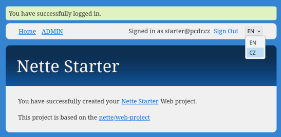
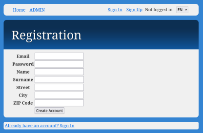
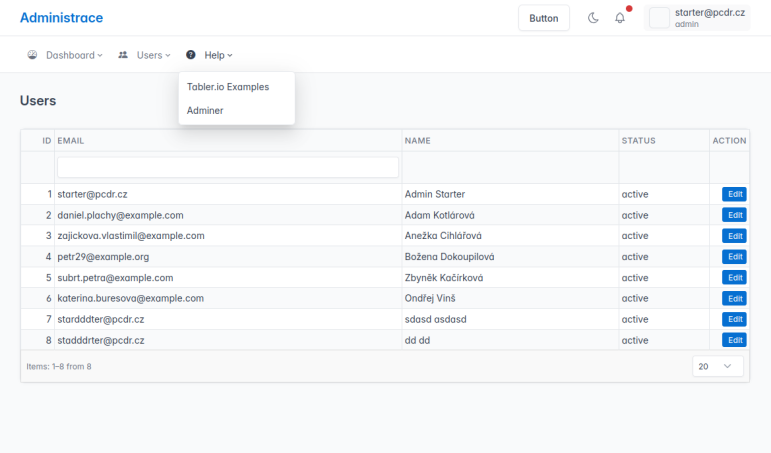
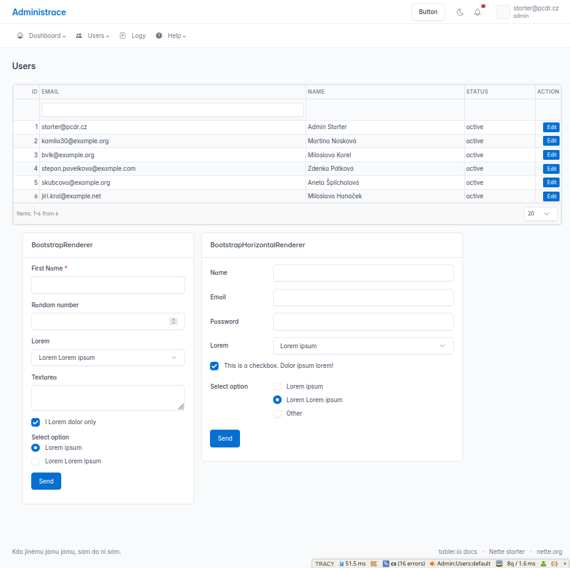

A web application skeleton built with **[Nette Framework](https://github.com/nette/nette)**, **[Nettrine](https://github.com/nettrine)** (Doctrine ORM for Nette), and **[Vite](https://github.com/vitejs/vite)**, featuring ready-to-use **user login/registration**, **translations** via **[contributte/translation](https://github.com/contributte/translation)** and **[contributte/datagrid](https://github.com/contributte/datagrid)**.
This project comes pre-configured with **[Bootstrap 5](https://github.com/twbs/bootstrap)** and **[Tabler](https://github.com/tabler/tabler)** for a responsive administration UI.


## Features

- **Stack**: [Nette 3.2](https://github.com/nette/nette), PHP 8.2+, [Vite](https://github.com/vitejs/vite) (HMR + auto reload for Latte templates).
- **ORM**: [Doctrine 2](https://github.com/doctrine/orm) via [Nettrine](https://github.com/nettrine).
- **Auth**: Pre-configured user registration, login, and basic management example
- **Admin UI**: [Tabler Admin Dashboard](https://github.com/tabler/tabler) (Bootstrap 5) with a responsive layout.
- **DataGrid**: Powerful datagrid via [ublaboo/datagrid](https://github.com/ublaboo/datagrid) and [@contributte/datagrid](https://github.com/contributte/datagrid).
- **AJAX**: AJAX support via [Naja](https://naja.js.org/).
- **Translations**: Multi-language support using [contributte/translation](https://github.com/contributte/translation).
- **Assets**: Nette assets support with [Vite](https://github.com/vitejs/vite).
- **Tools**: PHP-CS-Fixer for code style, PHPStan for static analysis, Nette Tester for testing, and Tracy for debugging.
- **CLI**: Console support via [contributte/console](https://github.com/contributte/console).
- **Icons**: [Bootstrap Icons](https://icons.getbootstrap.com/) (CDN).
- **Forms**: Custom `BootstrapRenderer` and `BootstrapHorizontalRenderer` for easy Bootstrap 5 form rendering in administration.

## Project Structure

- `private/app`: PHP application logic (Presenters, Models, Services).
  - `Model`: Doctrine entities, repositories, and facades.
  - `Presentation`: Latte templates and Nette presenters.
- `private/config`: Configuration files (NEON).
- `private/lang`: Translation files.
- `private/assets`: Frontend source files (JS, CSS).
- `web`: Public directory (entry point, compiled assets).
- `tests`: Unit and integration tests.

## Prerequisites

- **PHP** >= 8.2
- **Node.js** >= 20 (v22 recommended)
- **MySQL** or **MariaDB** database

## Installation

1. **Install via Composer**
   ```bash
   composer create-project martyd420/nette-starter my-project
   cd my-project
   ```

2. **Install Frontend dependencies**
   ```bash
   nvm use 22
   npm install
   ```

3. **Database Configuration**
 
   Default configuration requires a local mysql/mariadb database `nsdb` (user: `nettestarter`, pass: `nettestarter123`). Use these credentials or override them in `private/config/local.neon`. Default database credentials are intended for **local development only**. See `private/config/local.neon.example` for reference.


4. **Initialize Database**
 
   Run the following command to create the schema and load default fixtures (admin user):
   ```bash
   composer db:reset
   ```

5. **Build Assets**
   For production build:
   ```bash
   npm run build
   ```

## Development

### 1. Start Frontend Server (Vite)
This will start the Vite development server (usually on port 5173) with Hot Module Replacement (HMR).
```bash
npm run dev
```

### 2. Start Backend Server
You can use the built-in PHP server or your preferred web server (Apache/Nginx/Docker).
To use the built-in PHP server:
```bash
php -S localhost:8000 -t web
```

Access the application at: `http://localhost:8000`

### 3. Database Management
For further database changes during development, you can use Doctrine migrations or schema-tool via console:
```bash
# Generate migration
php private/cli/console.php migrations:diff

# Apply migrations
php private/cli/console.php migrations:migrate
```

## Default Credentials

The `composer db:reset` command creates a default administrator account - **development only credentials**:

- **Email:** `starter@pcdr.cz`
- **Password:** `123456`

## Available Commands

### Composer Scripts
Defined in `composer.json`:

- `composer db:reset`: **Destructive!** Drops the database schema, clears cache, creates new schema, and loads fixtures.
- `composer cs:check`: Checks code style with PHP-CS-Fixer (dry-run).
- `composer cs:fix`: Automatically fixes code style with PHP-CS-Fixer.
- `composer phpstan`: Runs static analysis on `private/app`.
- `composer tester`: Runs unit/integration tests.
- `php private/cli/console.php`: Access to various Doctrine and system commands.

### NPM Scripts
Defined in `package.json`:

- `npm run dev`: Starts the Vite development server.
- `npm run build`: Builds frontend assets for production (`web/assets/`).

### Screenshots





